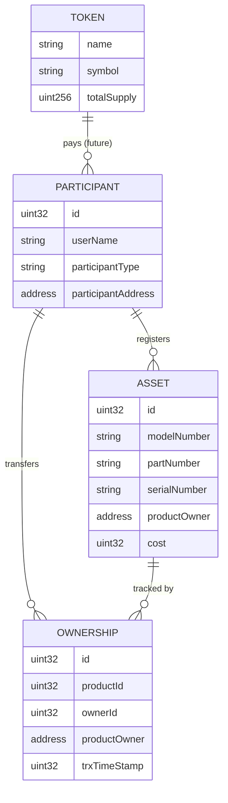

# Supply Chain Smart Contract dApp

Solidity supply-chain dApp prototype for asset tracking, participant management, ownership history and token-based workflows.

This repository demonstrates a blockchain-backed supply chain model where manufacturers register products, participants transfer ownership through defined roles, and provenance is recorded on-chain. An ERC-20 token is deployed alongside the main contract as a foundation for future payment workflows.

## Entity Model



### Roles

| Role | Description |
|------|-------------|
| **Manufacturer** | Registers new products on the chain |
| **Supplier** | Receives and forwards products between supply chain stages |
| **Consumer** | Final recipient of a product |

### Allowed ownership transfers

```
Manufacturer → Supplier → Supplier → Consumer
```

## Main Contract: `supplyChain`

The core contract lives in [`contracts/SupplyChain.sol`](contracts/SupplyChain.sol). It stores participants, products (assets), ownership records, and a per-product provenance trail.

**Key design choices:**

- Participants are identified by incremental IDs and linked to Ethereum addresses.
- Only `Manufacturer` participants can register products via `addProduct`.
- Ownership changes are enforced by role (`newOwner`) and by the `onlyOwner` modifier (the current product owner must sign the transaction).
- Each transfer appends an ownership record and updates `productTrack` for provenance queries.

A companion ERC-20 token ([`contracts/erc20Token.sol`](contracts/erc20Token.sol)) is deployed in the same migration. It is **not yet wired** into `supplyChain` payment flows; it exists as a separate building block for token-based settlement.

## Function Reference

### `supplyChain`

| Function | Access | Description |
|----------|--------|-------------|
| `addParticipant(name, password, address, type)` | Public | Registers a new participant; returns participant ID |
| `getParticipant(id)` | View | Returns name, address, and type |
| `authenticateParticipant(id, name, password, type)` | View | Validates participant credentials |
| `addProduct(ownerId, model, part, serial, cost)` | Public | Creates a product (Manufacturer only); returns product ID |
| `getProduct(id)` | View | Returns product metadata and current owner |
| `newOwner(fromId, toId, productId)` | `onlyOwner` | Transfers product ownership between allowed roles |
| `getOwnership(ownershipId)` | View | Returns a single ownership record |
| `getProvenance(productId)` | View | Returns ownership IDs for a product's full trail |

### `ERC20Token`

| Function | Description |
|----------|-------------|
| `transfer(to, value)` | Send tokens to another address |
| `transferFrom(from, to, value)` | Transfer on behalf of an approved spender |
| `approve(spender, value)` | Allow a spender to transfer tokens |
| `balanceOf(owner)` | Query token balance |
| `allowance(owner, spender)` | Query approved spending limit |
| `totalSupply()` | Total tokens in circulation |

## Tech Stack

- **Solidity** `0.5.x`
- **Truffle** — compile, test, and deploy
- **Ganache** — local Ethereum node (port `7545`)
- **Sepolia** — optional testnet deployment via Infura

## Prerequisites

- [Node.js](https://nodejs.org/) 18+
- [Ganache](https://trufflesuite.com/ganache/) (GUI or CLI) for local deployment

## Commands

```bash
# Install dependencies
npm install

# Compile contracts
npm run compile

# Start local Ganache (keep running in a separate terminal)
npm run ganache

# Run the full test suite (requires Ganache on port 7545)
npm test

# Deploy to local Ganache
npm run migrate:local
```

### Local deployment workflow

1. Start Ganache on `127.0.0.1:7545`.
2. Run `npm run migrate:local`.
3. Open the Truffle console to interact with deployed contracts:

```bash
npx truffle console --network development
```

Example console session:

```javascript
const sc = await supplyChain.deployed();
await sc.addParticipant("Alice", "secret", accounts[0], "Manufacturer");
await sc.getParticipant(0);
```

### Optional: Sepolia testnet

1. Copy `.env.example` to `.env` and fill in your wallet mnemonic and Infura API key.
2. Fund the deployer account with Sepolia ETH.
3. Deploy:

```bash
npx truffle migrate --network sepolia --reset
```

## Project Structure

```
contracts/
  SupplyChain.sol      # Main supply chain logic
  erc20Token.sol       # ERC-20 payment token (standalone)
  erc20Interface.sol   # EIP-20 interface
  Migrations.sol       # Truffle migration tracker
migrations/            # Deployment scripts
test/                  # Automated test suite
truffle-config.js      # Network and compiler settings
build/                 # Generated by `npm run compile` (not committed)
```

## Testing

The automated suite covers:

- Participant registration, lookup, and authentication
- Product creation and role-based restrictions
- Ownership transfers and provenance tracking
- ERC-20 minting, transfer, approve, and `transferFrom`

Manual console scenarios are documented in [`test/dirtyTest.txt`](test/dirtyTest.txt).

## Frontend

This prototype has **no web frontend**. Interaction is through Truffle tests and the Truffle console. A future UI could connect via Web3.js or Ethers.js against the deployed contract ABI in `build/contracts/`.

## Limitations

- **Portfolio prototype** — built for learning and demonstration, not production use.
- **Not audited** — do not deploy with real assets or sensitive data.
- **Plain-text passwords on-chain** — credentials are stored unhashed; a production system would use off-chain auth or cryptographic proofs.
- **Solidity 0.5.x** — uses deprecated patterns (`now`, unchecked arithmetic in the ERC-20 helper).
- **Token not integrated** — the ERC-20 contract deploys independently; payment flows described in early design docs are not implemented in `supplyChain`.
- **No access control on `addParticipant`** — any caller can register participants.

## What I Learned

- Modeling a supply chain as **on-chain state** (participants, assets, ownership events) makes provenance auditable but expensive to scale.
- **Role-based transfer rules** in Solidity require careful encoding of business logic; string comparisons on participant types are simple but gas-heavy.
- The **`onlyOwner` modifier** ties actions to `msg.sender`, which is the right pattern for custody transfers but requires clients to sign from the correct wallet.
- **Separating the ERC-20 token** from the supply chain contract keeps concerns isolated, but integration (escrow, payment-on-transfer) needs explicit design.
- **Truffle migrations and tests** provide a reproducible local workflow; Ganache + `truffle test` is enough to validate core behavior without a testnet.
- Testnets evolve — local Ganache and Sepolia are the practical targets today; deprecated networks should not appear in portfolio documentation.

## License

MIT — use freely for learning and portfolio purposes.
