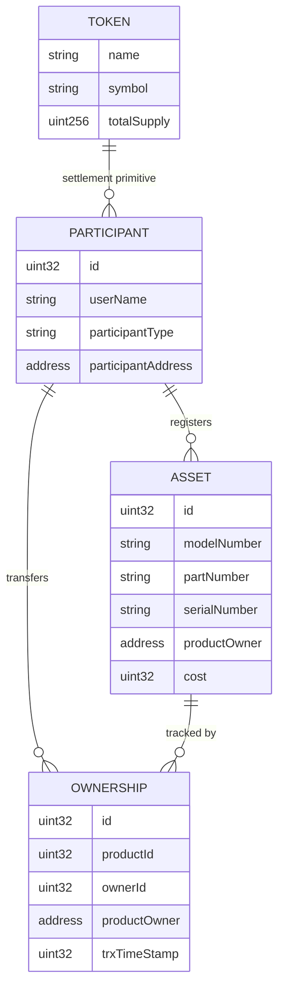

# Supply Chain Smart Contract dApp

Solidity supply-chain dApp prototype for asset tracking, participant management, ownership history and token-based workflows.

Modern **Solidity 0.8.x** implementation with **Hardhat**, automated tests, coverage reporting, and a runnable console demo. Manufacturers register products on-chain, participants transfer ownership through role-based rules, and provenance is recorded as an auditable trail.

## Entity Model



### Roles

| Role | Description |
|------|-------------|
| **Manufacturer** | Registers new products on the chain |
| **Supplier** | Receives and forwards products between supply chain stages |
| **Consumer** | Final recipient of a product |

### Allowed ownership transfers

```
Manufacturer → Supplier → Supplier → Consumer
```

## Main Contract: `SupplyChain`

The core contract lives in [`contracts/SupplyChain.sol`](contracts/SupplyChain.sol). It stores participants, products (assets), ownership records, and a per-product provenance trail.

**Key design choices:**

- Participants are identified by incremental IDs and linked to Ethereum addresses.
- Only `Manufacturer` participants can register products via `addProduct`.
- Ownership changes are enforced by role (`newOwner`) and by the `onlyOwner` modifier (the current product owner must sign the transaction).
- Each transfer appends an ownership record and updates `productTrack` for provenance queries.

The ERC-20 token ([`contracts/ERC20Token.sol`](contracts/ERC20Token.sol)) is included as a **separate settlement primitive**, not integrated into the main supply-chain flow in this version. It demonstrates token minting, transfer, and allowance patterns alongside the tracking contracts.

## Function Reference

### `SupplyChain`

| Function | Access | Description |
|----------|--------|-------------|
| `addParticipant(name, password, address, type)` | Public | Registers a new participant; returns participant ID |
| `getParticipant(id)` | View | Returns name, address, and type |
| `authenticateParticipant(id, name, password, type)` | View | Validates participant credentials |
| `addProduct(ownerId, model, part, serial, cost)` | Public | Creates a product (Manufacturer only); returns product ID |
| `getProduct(id)` | View | Returns product metadata and current owner |
| `newOwner(fromId, toId, productId)` | `onlyOwner` | Transfers product ownership between allowed roles |
| `getOwnership(ownershipId)` | View | Returns a single ownership record |
| `getProvenance(productId)` | View | Returns ownership IDs for a product's full trail |

### `ERC20Token`

| Function | Description |
|----------|-------------|
| `transfer(to, value)` | Send tokens to another address |
| `transferFrom(from, to, value)` | Transfer on behalf of an approved spender |
| `approve(spender, value)` | Allow a spender to transfer tokens |
| `balanceOf(owner)` | Query token balance |
| `allowance(owner, spender)` | Query approved spending limit |
| `totalSupply()` | Total tokens in circulation |

## Tech Stack

- **Solidity** `0.8.20`
- **Hardhat** — compile, test, deploy, and coverage
- **Ethers.js v6** — contract interaction in scripts and tests
- **Sepolia** — optional testnet deployment via Infura

## Prerequisites

- [Node.js](https://nodejs.org/) 18+

## Commands

```bash
# Install dependencies
npm install

# Compile contracts
npm run compile

# Run the full test suite
npm test

# Generate coverage report (see coverage/ after run)
npm run coverage

# Deploy to the built-in Hardhat network
npm run deploy:local

# Run the end-to-end console demo
npm run demo
```

### Optional: Sepolia testnet

1. Copy `.env.example` to `.env` and fill in your Infura API key plus mnemonic or private key.
2. Fund the deployer account with Sepolia ETH.
3. Deploy:

```bash
npm run deploy:sepolia
```

## End-to-End Example

The automated test in [`test/EndToEnd.test.js`](test/EndToEnd.test.js) and the demo script [`scripts/demo.js`](scripts/demo.js) follow the same flow:

```
Manufacturer creates product
        ↓
Supplier receives ownership
        ↓
Consumer receives ownership
        ↓
Provenance trail queried on-chain
```

Run the demo:

```bash
npm run demo
```

**Sample output:**

```
=== Supply Chain Demo ===

Contract: 0x5FbDB2315678afecb367f032d93F642f64180aa3

1) Participants registered
   Manufacturer: 0xf39Fd6e51aad88F6F4ce6aB8827279cffFb92266
   Supplier:     0x70997970C51812dc3A010C7d01b50e0d17dc79C8
   Consumer:     0x3C44CdDdB6a900fa2b585dd299e03d12FA4293BC

2) Manufacturer created product #0 (Widget-X)
3) Supplier received product #0
4) Consumer received product #0

5) Final product state
   Model:        Widget-X
   Serial:       SN-001
   Current owner: 0x3C44CdDdB6a900fa2b585dd299e03d12FA4293BC

6) Provenance trail (ownership record IDs)
   0 -> 1
   Record #0: participant 1 now owns product 0
   Record #1: participant 2 now owns product 0

7) Manufacturer authentication: true
```

## Test Coverage

| Suite | What it covers |
|-------|----------------|
| `SupplyChain.test.js` | Participants, auth, products, ownership, provenance |
| `ERC20Token.test.js` | Mint, transfer, approve, `transferFrom` |
| `EndToEnd.test.js` | Full manufacturer → supplier → consumer flow |

```bash
npm test        # 11 tests
npm run coverage
```

Latest coverage (`npm run coverage`):

| Metric | Coverage |
|--------|----------|
| Statements | 95% |
| Lines | 96.4% |
| Functions | 93.8% |
| Branches | 57.1% |

After `npm run coverage`, open `coverage/index.html` for the full report.

## Project Structure

```
contracts/
  SupplyChain.sol      # Main supply chain logic
  ERC20Token.sol       # ERC-20 settlement primitive (standalone)
  ERC20Interface.sol   # EIP-20 interface
scripts/
  deploy.js            # Deployment script
  demo.js              # Runnable end-to-end console demo
test/                  # Hardhat test suite
hardhat.config.js      # Network and compiler settings
```

## Frontend

This prototype has **no web frontend**. Interaction is through Hardhat tests, deployment scripts, and the `npm run demo` console workflow. A future UI could connect via Ethers.js against the compiled ABI in `artifacts/`.

## Limitations

- **Portfolio prototype** — built for learning and demonstration, not production use.
- **Not audited** — do not deploy with real assets or sensitive data.
- **Plain-text passwords on-chain** — credentials are stored unhashed; a production system would use off-chain auth or cryptographic proofs.
- **ERC-20 is standalone** — the token is a separate settlement primitive; supply-chain transfers do not trigger token payments in this version.
- **No access control on `addParticipant`** — any caller can register participants.

## What I Learned

- Modeling a supply chain as **on-chain state** (participants, assets, ownership events) makes provenance auditable but expensive to scale.
- **Role-based transfer rules** in Solidity require careful encoding of business logic; string comparisons on participant types are simple but gas-heavy.
- The **`onlyOwner` modifier** ties actions to `msg.sender`, which is the right pattern for custody transfers but requires clients to sign from the correct wallet.
- **Separating the ERC-20 token** from the supply chain contract keeps concerns isolated; integrating settlement would be a deliberate next step, not an afterthought.
- **Hardhat + Solidity 0.8.x** gives a modern local workflow: built-in network, Ethers.js tests, coverage, and deploy scripts without external Ganache.
- Testnets evolve — local Hardhat and Sepolia are the practical targets for portfolio work today.

## License

MIT — see [LICENSE](LICENSE).
